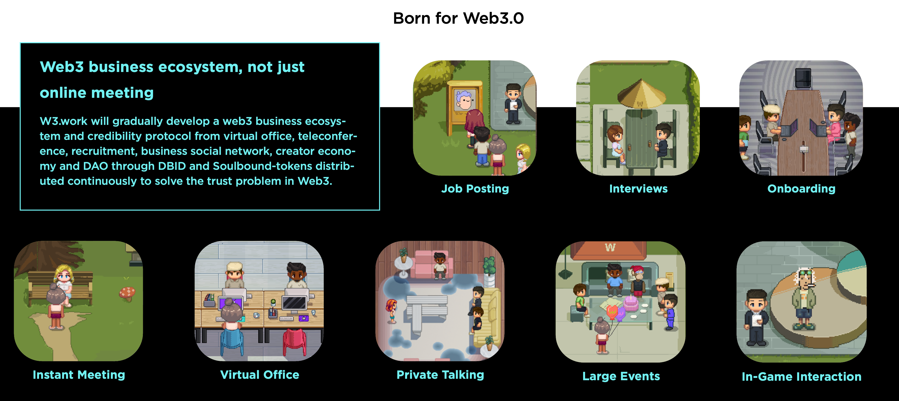

# w3work

### Work & Collab together in Web3.0
### [Try our our alpha version](https://alpha.w3.work/)

W3.work: Headquarters in Metaverse


W3.work is a fully decentralized social Metaverse for Web3.0 professionals, which
significantly improves the efficiency of social events, remote working and community interaction for Web3.0 teams.

## W3.work Provide Many Things
- A workplace for Web3 professionals - making remote work more engaging.
- A Metaverse for business and social networking - connecting Web3.0 organizations, teams, VCs,
  and creators.
- W3.events - 100% decentralized events protocol.
- A fun, new Web3 Work-style - empowering innovation and creativity



## Project setup
```
npm install
```

### Compiles and hot-reloads for development
```
npm run serve
```

### Compiles and minifies for production
```
npm run build
```

### Lints and fixes files
```
npm run lint
```

### Customize configuration
See [Configuration Reference](https://cli.vuejs.org/config/).
